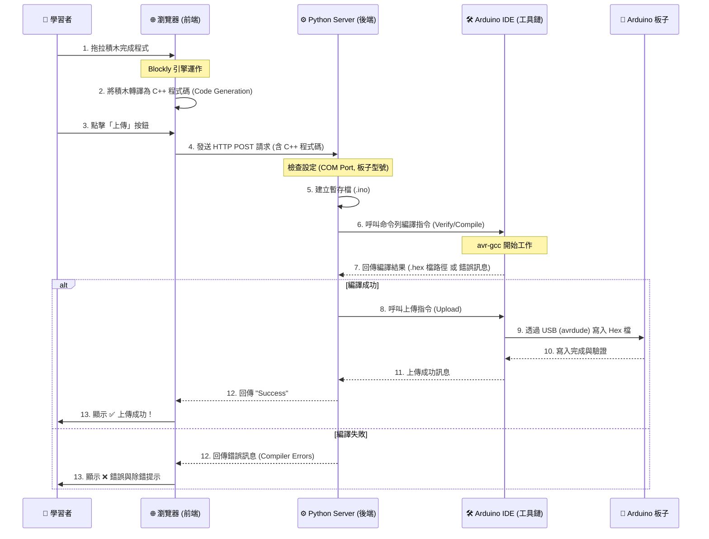

# Ardublockly 運作流程圖解 (Behind the Scenes)

當學習者按下「上傳」按鈕時，Ardublockly 在短短幾秒內完成了以下複雜的接力賽：

## 詳細步驟解析

### 第一階段：前端轉譯 (The Translation)
*   **動作**：使用者在網頁上拖拉積木。
*   **幕后**：瀏覽器裡的 JavaScript (Blockly) 即時監聽變化，並根據定義好的規則，把「積木結構 (XML)」翻譯成「Arduino C++ 原始碼」。這一切都發生在瀏覽器記憶體中，還沒碰到後端。

### 第二階段：中介傳輸 (The Handover)
*   **動作**：使用者按下上傳。
*   **幕后**：前端把剛剛產生的那串 C++ 文字，打包成一個 HTTP POST 請求，發送給本機的 Python Server (通常是 `localhost:8000`)。

### 第三階段：後端調度 (The Orchestration)
*   **動作**：`ardublocklyserver` 接到請求。
*   **幕后**：
    1.  它先把它存成一個實際的 `.ino` 檔案。
    2.  它讀取您的設定 (例如 COM3, Arduino Uno)。
    3.  它像指揮官一樣，組裝出一串長長的指令，例如：
        `arduino_debug.exe --upload --port COM3 --board arduino:avr:uno sketch.ino`

### 第四階段：編譯與燒錄 (The Heavy Lifting)
*   **動作**：Arduino IDE (CLI) 開始工作。
*   **幕后**：
    1.  **編譯 (Compile)**：呼叫 `avr-gcc`，把人類看得懂的 C++ 變成機器看得懂的二進位碼 (`.hex`)。如果有語法錯誤 (例如少個分號)，這裡就會爆開。
    2.  **上傳 (Upload)**：呼叫 `avrdude`，透過 USB 線跟 Arduino 板子上的 Bootloader 對話，把 `.hex` 檔一個 byte 一個 byte 寫進晶片裡。

### 第五階段：回報 (The Feedback)
*   **動作**：介面顯示結果。
*   **幕后**：原本的 HTTP 請求終於收到回應 (Response)。前端解析這個回應，如果是成功就放煙火，失敗就跳出紅字告訴你哪一行錯了。
